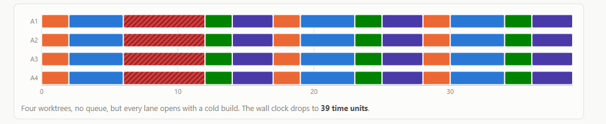
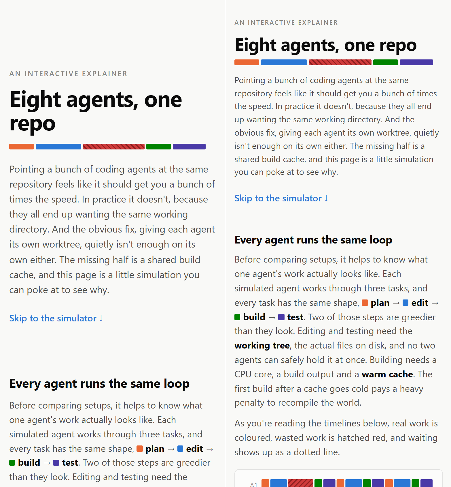

# PROCESS.md

I picked my order of work up front, CLAUDE.md
first, then the timeline code, then the page around it, and these are
the moments where it paid off.

## 1. Time units instead of seconds

The page I have put together simulates / visualises a bunch of coding agents on
one repository, each drawn as a row of blocks, plan, edit, build,
test, and every block needed a length. The obvious move was giving
them real looking timings, a build takes forty seconds, and it would
have looked more impressive. But before any code I put a rule in my
CLAUDE.md that the page never claims real times, everything runs on
made up time units instead of seconds
([`c1a4653`](https://github.com/comp4020-agentic-coding-studio/comp4020-ass1-PressJump/commit/c1a4653)).
All the numbers sit in one file, `src/model.ts`, so nobody can argue
with me about whether a build really takes forty seconds, the page
never said it did, it only shows which setup finishes faster, and that
holds whatever numbers I pick. I did not just eyeball that either, one
of my property tests checks the ordering at every agent count, so the
numbers cannot quietly flip the story without a test going red.

## 2. One of my own rules could not be true

In my plan I wrote that the real work each agent does must add up the
same across all three setups, because it sounded solid to me. Before any code the agent pointed out it cannot be true, cold builds are longer than incremental ones, so correct
timelines would break my own rule. My first thought was to just drop
it, but when it asked me which way I wanted to go I had it rework the
timeline maths instead, so every build splits into an incremental part that
counts as real work and a cold penalty that counts as overhead
([`13e3fd1`](https://github.com/comp4020-agentic-coding-studio/comp4020-ass1-PressJump/commit/13e3fd1)).
What convinced me was my rule became true again, and the waste I
nearly dropped is now the hatched red you can actually see on my page.
A test now pins it as well, every agent does exactly the same busy
work in every setup at every agent count, so if my rule ever breaks
again I will hear about it.

## 3. The rule I did not carry forward came back

In week 2, when working upon my crit I saw that my code and hero section text
was full of em dashes and the other tells that a page was AI generated [1], 
which readers punish, about half spot AI copy and
as many switch off when they suspect it [3]. Due to this reason,
in my CLAUDE.md I added rules against certain tells like em dashes, colons, 
gradient colors and cream colored backgrounds [2], with a test that
fails the build if there is a single em dash or blocked tell, and I
noted in my reflection that I would carry it into the next repo. But
when I scaffolded this repo I forgot to add the rules I had composed in
crit 2, and the tells came straight back, which cost me two separate
sweeps to get rid of them
([`da72959`](https://github.com/comp4020-agentic-coding-studio/comp4020-ass1-PressJump/commit/da72959),
[`f9854be`](https://github.com/comp4020-agentic-coding-studio/comp4020-ass1-PressJump/commit/f9854be)).
I added the rule straight back into my CLAUDE.md for this codebase and 
the only em dashes left sit in code comments no visitor reads, which I
made sure of by searching the page copy for every blocked tell. 
Week 2 proved why it belongs in the harness, the agent reaches for that style by default, a retry
fixes today's copy, a rule fixes all of it.

## 4. The agent said the phone was fine, my phone said otherwise

When I was testing the app, to see if the UI is looking good or not
I made sure to also check the responsiveness of the website both
on my computer and also on a physical phone to make sure. In theory
the agent checked the timeline when it did its first commit
([`787016f`](https://github.com/comp4020-agentic-coding-studio/comp4020-ass1-PressJump/commit/787016f))
by emulating a 375px viewport but this does not equate to all kinds of different devices.
I saw this first hand where the agent saw no overflow, or any ui responsiveness bugs
on the emulated view and thought it had successfully completed the mobile layout. 
I have had this problem in past projects and have experience with it, where the emulated
viewport agrees but a real screen does not, so I wanted to see for
myself if that was the case. I opened the dev server on my phone over my laptop's IP and saw that
it was way too zoomed in, the heading filling my screen like a desktop
page scaled up. I told it what I was seeing and got the small screens
zoomed back out, a smaller root font and tighter spacing under
44rem and made sure to tighten my CLAUDE.md file with more rules
for mobile layout responsiveness of the website and testing
([`0d63c87`](https://github.com/comp4020-agentic-coding-studio/comp4020-ass1-PressJump/commit/0d63c87)).
What the agent sees can be fine on its end, but it is still very important
to manually verify and review the work generated by a LLM and this is the best
instance of it where the layouts for mobile devices can be broken, too zoomed in
or just not match the UI styling standard that was set out in the rest of the project.

## References

1. [Signs of AI writing](https://en.wikipedia.org/wiki/Wikipedia:Signs_of_AI_writing),
   the Wikipedia AI Cleanup guide to AI text tells.
2. [AI slop fonts and gradients](https://www.925studios.co/blog/ai-slop-design-tells),
   925 Studios, on the design tells.
3. [AI vs human-made content](https://www.bynder.com/en/press-media/ai-vs-human-made-content-study/),
   Bynder, on readers rejecting AI copy.
