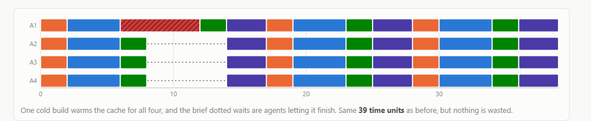
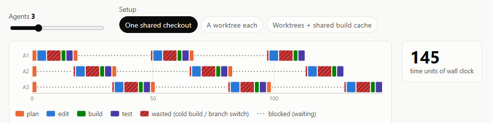

# Assignment 1 reflection

## What was the breakthrough that moved the work forward?

My page is about what happens when you run a bunch of AI coding agents
on the same codebase at once, because it feels like eight agents should
give you eight times the speed but in reality they end up fighting over
the same folder of code and waiting for each other. I picked the topic
because it is something I actually know well, since I have worked with
this kind of software for a while and I was the maintainer of one of
these tools myself, so I have seen the queueing and the wasted rebuilds
happen for real, and I knew the fix that barely gets talked about,
which is giving every agent its own copy of the code [3] while they all
share one build cache [4].

In the development of the website, I looked at https://john.fun/elevators
as a reference [1], which was provided in the assignment spec. This was
actually a website I had seen in the start of August on HackerNews [2]
and I knew I
wanted to make my website for this assessment something that was close to
it for displaying and showing information in a creative and interactive
way. My first version of the page was nothing like that though, it was
just the slider, the three setup buttons and one timeline
([`787016f`](https://github.com/comp4020-agentic-coding-studio/comp4020-ass1-PressJump/commit/787016f)),
and it worked but it read like a tool you had to already understand
rather than a page that explains something to you.

The breakthrough was a pretty simple decision in the end, which was to
not write the explanation separately from the page. Instead of putting
screenshots or made up example numbers into the story sections, each
section just has another copy of the timeline in it, drawn by the same
scheduler code as the main one
([`13e3fd1`](https://github.com/comp4020-agentic-coding-studio/comp4020-ass1-PressJump/commit/13e3fd1))
but locked to a fixed setting, and the numbers in the captions get
filled in by that code as well rather than typed by hand
([`4fc796b`](https://github.com/comp4020-agentic-coding-studio/comp4020-ass1-PressJump/commit/4fc796b)).
So when a caption says the wall clock lands at 39 time units, that
number came from the page working it out and not from me writing it,
and if I ever change how the timelines are worked out the captions
update themselves, so the text cannot end up disagreeing with what is
drawn right above it.

That choice also forced the writing to be honest in a way I did not
expect, because at four agents the two worktree setups genuinely tie on
wall clock, and since the caption number comes straight out of the
calculation I could not round the story up to a win, so I had to write
that the win hides in the wasted rebuilds and send the visitor down to the lab to
crank the agent count and watch the gap open for themselves, which
honestly made the page better than the version where I could have just
claimed it.

The habit I am taking from this is to let the page do the talking
instead of describing it myself, because numbers typed into the text go
stale the moment the thing they describe changes, while numbers the
page works out fresh each time cannot. That is also what I liked about
Elevators in the first place, since everything it tells you comes from
the elevators actually moving around on screen rather than from a
write up next to a picture of them. It is still cool to me, and it
makes sense why HackerNews rated it so high. I had a great time working
on this assessment and I am happy with the work I have put together and hope
everyone checking it out will find it cool to see how worktrees and caching
makes development time quicker with agents!

## References

1. [Elevators](https://john.fun/elevators), John, the interactive
   simulation the brief linked and this page's reference point.
2. [Show HN: Elevators](https://news.ycombinator.com/item?id=49124218),
   the Hacker News thread from the start of August, 1,680 points.
3. [git worktree](https://git-scm.com/docs/git-worktree), the Git
   feature that gives each agent its own checkout.
4. [ccache](https://ccache.dev), a compiler cache, one way the build
   cache gets shared in practice.
